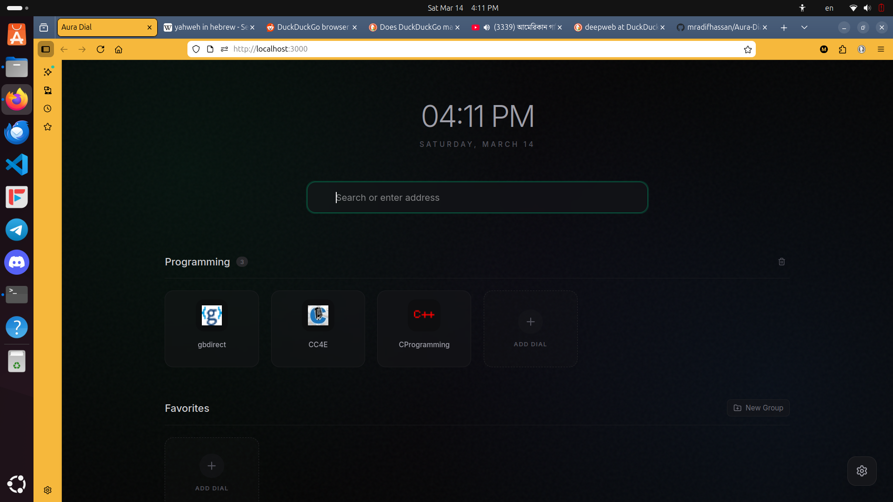

# Aura Dial

A minimalist, high-performance speed dial startup page inspired by Opera, built for power users. Aura Dial provides a clean, atmospheric command center for your web browsing, featuring customizable groups, drag-and-drop reordering, and instant local performance.



## Features

- **Atmospheric Aura**: Deep black theme with ambient glows and a subtle noise texture for a premium feel.
- **Drag & Drop**: Effortlessly reorder your dials with smooth, physics-based animations.
- **Group Management**: Organize sites into categories (Work, Social, Dev, etc.).
- **Instant Favicons**: High-quality icons fetched automatically for every site.
- **Zero-Latency Search**: Integrated Google search bar.
- **Local First**: Your data stays on your machine in a local SQLite database.

---

## Prerequisites

Aura Dial requires **Node.js 20 or higher**. Using an older version (like v18) will cause errors during startup.

**Check your version:**
```bash
node -v
```

---

## Installation (All Platforms)

1. **Download the code** and extract it to a folder (e.g., `~/aura-dial`).
2. **Open your terminal** in that folder.
3. **Install dependencies**:
   ```bash
   npm install
   ```

---

## Platform-Specific Setup

### Linux (Ubuntu/Debian) - Recommended
To make Aura Dial a permanent background service:

1. **Install NVM and Node 22**:
   ```bash
   curl -o- https://raw.githubusercontent.com/nvm-sh/nvm/v0.39.7/install.sh | bash
   source ~/.bashrc
   nvm install 22 && nvm use 22
   ```
2. **Create a System Service**:
   ```bash
   sudo nano /etc/systemd/system/auradial.service
   ```
3. **Paste this config** (Replace `yourusername` and verify the `npm` path with `which npm`):
   ```ini
   [Unit]
   Description=Aura Dial Service
   After=network.target

   [Service]
   Type=simple
   User=yourusername
   WorkingDirectory=/home/yourusername/aura-dial
   ExecStart=/home/yourusername/.nvm/versions/node/v22.22.1/bin/npm run dev
   Restart=on-failure
   Environment=NODE_ENV=production
   Environment=PATH=/home/yourusername/.nvm/versions/node/v22.22.1/bin:/usr/local/bin:/usr/bin:/bin

   [Install]
   WantedBy=multi-user.target
   ```
4. **Enable & Start**:
   ```bash
   sudo systemctl daemon-reload
   sudo systemctl enable auradial
   sudo systemctl start auradial
   ```

### Windows
1. **Install Node.js**: Download the latest LTS version from [nodejs.org](https://nodejs.org/).
2. **Run the app**:
   ```powershell
   npm run dev
   ```
3. **Auto-start**: Press `Win + R`, type `shell:startup`, and create a shortcut to a `.bat` file that runs `npm run dev` in your project folder.

### macOS
1. **Install Node.js**: Use Homebrew (`brew install node`) or NVM.
2. **Run the app**:
   ```bash
   npm run dev
   ```
3. **Auto-start**: Use **Automator** to create an "Application" that runs the shell script `cd ~/aura-dial && npm run dev`, then add that application to your **Login Items** in System Settings.

---

## Browser Configuration (Firefox)

1. **Homepage**: Go to `Settings > Home`. Set **Homepage and new windows** to **Custom URLs** and enter `http://localhost:3000`.
2. **New Tab Page**: Firefox doesn't allow custom URLs for new tabs by default. Install the [New Tab Override](https://addons.mozilla.org/en-US/firefox/addon/new-tab-override/) extension and set its URL to `http://localhost:3000`.

---

## Ultimate Troubleshooting Guide

### 1. `TypeError [ERR_INVALID_URL_SCHEME]`
- **Cause**: You are using Node.js v18 or older.
- **Solution**: Upgrade to Node.js 20 or 22. On Linux/Mac, use `nvm install 22`. On Windows, download the latest installer.

### 2. `failed to load config from vite.config.ts`
- **Cause**: Node version mismatch or corrupted `node_modules`.
- **Solution**: 
  ```bash
  rm -rf node_modules package-lock.json
  npm install
  ```

### 3. `status=203/EXEC` or `status=217/USER` (Linux)
- **Cause**: The `auradial.service` file has an incorrect path to `npm` or an incorrect username.
- **Solution**: Run `which npm` and `whoami`. Ensure these values match exactly in your `/etc/systemd/system/auradial.service` file.

### 4. App starts but exits silently
- **Cause**: The database driver (`better-sqlite3`) was compiled for a different Node version.
- **Solution**:
  ```bash
  npm rebuild better-sqlite3
  ```

### 5. "Unable to connect" in Firefox
- **Cause**: The server isn't running.
- **Solution**: Run `npm run dev` manually to check for errors. If using Linux, check the service status with `sudo systemctl status auradial`.

### 6. White flash during loading
- **Cause**: Browser rendering the default background before the CSS loads.
- **Solution**: (Already fixed in Aura Dial v1.1) We moved background styles to the root HTML to ensure an instant dark-mode experience.

---

